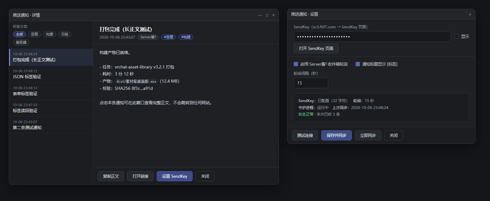

# WinPushReceiver · Server酱³ 推送 → Windows 原生通知

> 把 [Server酱³](https://sc3.ft07.com/) 的消息变成 **Windows 原生通知**（进通知中心），点击通知打开**本地详情窗口**——按标签分类、可标记已读/未读、可清理，**不跳浏览器**。
> 单个 C# 文件、单个 exe：.NET Framework + WinRT，**无第三方依赖**，常驻内存约 35 MB。



> 上图为设计效果图（HTML 稿），最终 WinForms 实现与之一致。

## 特性

| 能力 | 说明 |
|---|---|
| 收件箱轮询 | SendKey 登录 → 每 15 秒拉取，新消息立刻弹通知 |
| 原生通知 | WinRT toast，自定义 App 名与图标，可带 `[标签]` 前缀 |
| 本地详情窗口 | 标签分类（带条数）/ 未读筛选 / 列表含**正文预览** / 详情含徽标；正文可直接选中复制 |
| 已读未读 | 未读=白字+圆点，已读=灰字；支持「标记未读/已读」与「全部已读」 |
| 清理 | 删除当前 / 清理已读 / 全部清理（带确认弹窗，只删本机记录） |
| 全量回捞 | 「立即同步」会翻页把服务器缓存期内、本机缺失的历史消息补回来 |
| 系统托盘 | 右键菜单：打开详情 / 立即同步 / 全部已读 / 设置 / 退出；双击打开详情 |
| 本地 HTTP 投递 | 任何程序 `POST /notify` 也能弹通知（默认只监听 127.0.0.1，防跨站） |
| 常驻 | 计划任务登录自启；圆角 + 跟随主题配色的标题栏；自绘胶囊滚动条 |

## 快速开始

### 方式一：下载 Release（无需编译）

1. 从 [Releases](../../releases) 下载 `WinPushReceiver.exe` 与 `WinPushReceiver.exe.config`，放到同一个目录
2. 双击运行（无窗口，托盘出现图标）
3. 右键托盘图标 → **设置 SendKey** → 粘贴 [sc3.ft07.com/sendkey](https://sc3.ft07.com/sendkey) 的账号主 SendKey → 点「测试连接」→「保存并同步」

### 方式二：自行编译

只需要系统自带的 csc（无需 Visual Studio / Windows SDK 安装 / NuGet）：

```powershell
.\build.ps1
```

### 开机自启（可选）

```powershell
schtasks /Create /TN WinPushReceiver /TR "\"%LOCALAPPDATA%\WinPushReceiver\WinPushReceiver.exe\"" /SC ONLOGON /F
```

## 用法

### 托盘菜单

打开详情窗口 ｜ 立即同步（含历史）｜ 全部标记为已读 ｜ 设置 SendKey ｜ 退出

### 命令行

```text
WinPushReceiver.exe                                   # 守护进程（计划任务/自启用）
WinPushReceiver.exe --show "winpush://show?id=<id>"   # 打开详情窗口（通知点击走这里）
WinPushReceiver.exe --settings                        # 设置窗口（单实例）
WinPushReceiver.exe --cleanup                         # 清理弹窗
```

### 本地 HTTP 接口

| 方法 | 路径 | 说明 |
|---|---|---|
| POST | `/notify` | `title` / `body`(或 `desp`) / `url` / `tags`（`|` 分隔），支持 JSON 与表单 |
| GET | `/notifications?limit=N` | 最近 N 条（含 `tags`、`src`） |
| GET | `/show?id=` · `/settings` · `/sync[?full=1]` · `/reload` · `/health` | 开详情 / 开设置 / 同步（含全量）/ 重载配置 / 状态 |

示例：

```powershell
$b = @{ title='构建完成'; body="耗时 3 分 12 秒"; tags='构建|CI' } | ConvertTo-Json -Compress
Invoke-WebRequest http://127.0.0.1:8765/notify -Method Post -ContentType 'application/json; charset=utf-8' `
  -Body ([Text.Encoding]::UTF8.GetBytes($b)) -UseBasicParsing
```

## 配置

配置文件在 `%LOCALAPPDATA%\WinPushReceiver\PushReceiver.ini`（也可用设置窗口改）：

```ini
listen=127.0.0.1     # 0.0.0.0 = 局域网（务必设 token）
port=8765
token=               # 本地 HTTP 投递鉴权（非空启用）
click=window         # window=点通知开本地窗口；url=直接打开消息里的链接
sendkey=             # Server酱³ 主 SendKey
poll=1 / poll_interval=15
firstrun=import      # 首次同步：import=只弹最新一条 / all / skip
debug=1              # 1=首次同步记录服务端字段名；2=另记原始 JSON
toast_tag=1          # 通知标题显示 [标签]
log=1
```

## 数据文件（同在 `%LOCALAPPDATA%\WinPushReceiver\`）

| 文件 | 说明 |
|---|---|
| `notifications.jsonl` | 通知记录（含 `tags`/`src`/时间） |
| `read.txt` | 已读记录（服务端不提供已读状态，本地维护） |
| `seen.txt` | 已同步过的服务端消息 id；**删掉它会重新导入最近 100 条** |
| `PushReceiver.log` | 运行日志 |

## 工作原理

- **发送**：使用 Server酱³ 官方接口 `https://<uid>.push.ft07.com/send/<sendkey>.send`（本项目不改动它）。
- **接收**：Server酱³ **没有公开的接收侧 API**，本项目使用 `bot.ftqq.com` 上的收件箱接口（`POST /login/by/sendkey` 换取 token → `GET /sc3/push/index` 拉取消息，服务端字段实测为 `id, user_id, title, desp, tags, log, ip, created_at, updated_at`）。
  该接口**非官方公开文档**，线索来自 [Hurk1n/ServerChanDesktop](https://github.com/Hurk1n/ServerChanDesktop) 的逆向笔记（`REVERSE_NOTES.md`）。**它可能随时变更或失效**，请自行评估使用风险。
- 服务端只保留约 **72 小时**的消息缓存，超过窗口的消息无法取回。

## 已知限制 / 免责声明

1. 接收接口非官方，可能失效；本项目与 Server酱官方无关。
2. SendKey 是账号级凭据，明文保存在本机 ini 中（与本类客户端一致）；请勿分享该文件，泄露后请在官网重置。
3. 仅支持 Windows；需要 .NET Framework 4.8（Windows 10/11 自带）。
4. 项目按 MIT 协议“原样”提供，不承担任何使用后果。

## 开发笔记（踩过的坑）

1. **`JavaScriptSerializer` 把 JSON 数组反序列化成 `ArrayList`，不是 `object[]`** —— 曾导致收件箱整批解析为 null（一条都收不到）且 tag 永远读空。凡取数组统一走 `AsArray()`。
2. **`ControlStyles.UserPaint` 的自绘控件必须先擦满背景**再画圆角，否则四角残留旧像素；窗口 `Shown` 里补一次 `Invalidate(true)` 消除首帧位移残留。
3. **同一个窗口会被叠出多份**（按钮点击 + 外部启动）→ 看起来像“布局错乱”。桌面窗口一律命名 Mutex 单实例 + 激活已有窗口。
4. **DPI**：进程要声明 PerMonitorV2（`app.manifest` + 同名 `.config`），否则被系统位图拉伸发虚。
5. **`Timer` / `NotifyIcon` 只被局部变量引用会被 GC 回收** → 用静态列表持有引用。
6. **清掉 `WS_VSCROLL` 后控件不会重算客户区**，会留下旧滚动条像素 → 需要 `SetWindowPos(..., SWP_FRAMECHANGED)`。本项目列表最终改为**自绘控件**，从根上不产生原生滚动条。
7. **WinForms 窗体不会自动使用 exe 内嵌图标**，`Form.Icon` 未设置时用的是系统默认图标 → 需显式 `Icon.ExtractAssociatedIcon`。
8. **RichEdit 渲染 Emoji 呈现字符（如 U+2705 ✅）时字宽算错**，后续字符会重叠 → 显示前做字符净化（✅→✓ 等，仅影响显示）。
9. **量测脚本自身要先声明 DPI 感知**，否则 `GetWindowRect`（缩放坐标）与 UI Automation（物理坐标）对不上，会误判成程序渲染有问题。

## 许可

[MIT](LICENSE)

## 致谢

- [Hurk1n/ServerChanDesktop](https://github.com/Hurk1n/ServerChanDesktop)：其逆向笔记公开了收件箱接口线索。
- [Server酱](https://sc3.ft07.com/)：推送服务本身。
