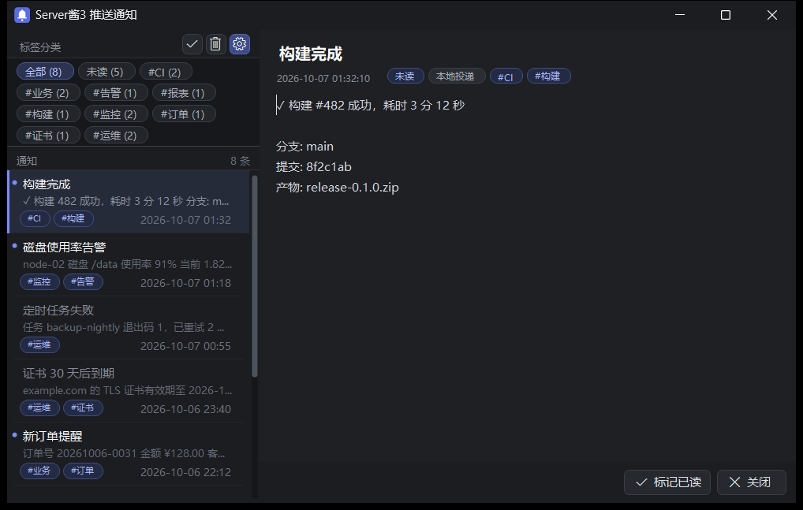

# ServerChan3-Windows-Notifier

> 把 [Server酱³](https://sc3.ft07.com/) 的推送变成 **Windows 原生通知**（进通知中心），点击通知打开**本地详情窗口**——按标签分类、可标记已读/未读、可清理，**不跳浏览器**。

**单个 exe，无第三方依赖，常驻内存约 35 MB。**



> 当前版本的真实界面截图（Windows 11 / 125% 缩放）；图中数据为演示用合成数据。

## 特性

| 能力 | 说明 |
|---|---|
| 收件箱轮询 | SendKey 登录 → 默认每 15 秒拉取，新消息立刻弹通知 |
| 原生通知 | WinRT toast，可带 `[标签]` 前缀，点击打开详情 |
| 详情窗口 | 标签分类（带条数）/ 未读筛选 / 列表正文预览 / 详情徽标 |
| 已读未读 | 未读=白字+圆点，已读=灰字；支持全部已读 |
| 清理 | 删除当前 / 清理已读 / 全部清理（带确认，只删本机记录） |
| 历史回捞 | 「立即同步」翻页补回服务器缓存期内、本机缺失的消息 |
| 托盘常驻 | 打开详情 / 立即同步 / 全部已读 / 设置 / 退出 |
| 本地投递 | `POST /notify`，任何程序都能弹通知（默认只监听 127.0.0.1） |

## 快速开始

1. 从 [Releases](../../releases) 下载 **`WinPushReceiver.exe`**（就一个文件）
2. 双击运行 —— 无窗口，托盘出现图标
3. 右键托盘图标 → **设置 SendKey** → 粘贴 [sc3.ft07.com/sendkey](https://sc3.ft07.com/sendkey) 的账号主 SendKey → 保存并同步

程序的数据与配置保存在**它自己所在的目录**（便携式）：换目录不会带走数据。

## 自行编译

只需系统自带的 csc（无需 Visual Studio / SDK / NuGet）：

```powershell
.\build.ps1
```

## 用法

```text
WinPushReceiver.exe                                   # 常驻（自启/计划任务用）
WinPushReceiver.exe --show "winpush://show?id=<id>"   # 打开详情（点通知走这里）
WinPushReceiver.exe --settings                        # 设置窗口
WinPushReceiver.exe --cleanup                         # 清理弹窗
```

本地 HTTP 接口：`POST /notify`（`title`/`body`/`url`/`tags`，支持 JSON 与表单）、`GET /notifications?limit=N`、`/show?id=`、`/settings`、`/sync[?full=1]`、`/reload`、`/health`。

## 配置

`PushReceiver.ini`（就在 exe 旁边，也可用设置窗口改）：

```ini
listen=127.0.0.1   # 0.0.0.0 = 局域网（务必设 token）
port=8765
token=             # 本地投递鉴权（非空启用）
click=window       # 点通知：window=本地窗口 / url=直接打开链接
sendkey=           # Server酱³ 主 SendKey
poll=1 / poll_interval=15
firstrun=import    # 首次同步：import=只弹最新一条 / all / skip
toast_tag=1        # 通知标题显示 [标签]
```

数据文件（同目录）：`notifications.jsonl` 通知记录 · `read.txt` 已读 · `seen.txt` 已同步 id（**删掉会重新导入最近 100 条**）· `PushReceiver.log` 日志。

## 工作原理

- **发送**走 Server酱³ 官方接口，本项目不改动它。
- **接收**用的是 `bot.ftqq.com` 的收件箱接口（`POST /login/by/sendkey` 换 token → `GET /sc3/push/index` 分页拉取）。该接口**非官方公开文档**，线索来自下面的致谢①，**可能随时变更或失效**。
- 服务端只保留约 **72 小时**消息，超窗无法取回。

## 免责声明

1. 接收接口非官方，可能失效；本项目与 Server酱官方无关。
2. SendKey 是账号级凭据，明文保存在本机 ini 中；请勿分享，泄露后请到官网重置。
3. 仅支持 Windows（需 .NET Framework 4.8，Win10/11 自带）。
4. 按 MIT 协议“原样”提供，不承担使用后果。

## 致谢

- [Hurk1n/ServerChanDesktop](https://github.com/Hurk1n/ServerChanDesktop) —— 其逆向笔记公开了收件箱接口的线索。
- [Server酱](https://sc3.ft07.com/) —— 推送服务本体。
- [DeepSeek](https://www.deepseek.com/) —— 代码/界面/文档在 **DeepSeek Harness** 中与 DeepSeek 模型协作完成。

## 许可

[MIT](LICENSE)
